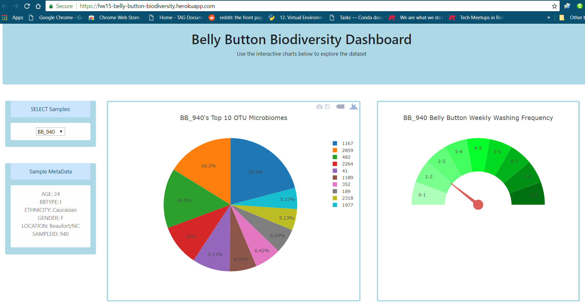
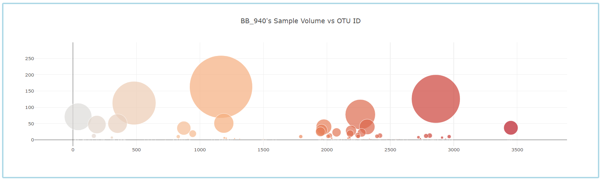

# HW15---Interactive-Visualizations-and-Dashboards
## Belly Button Biodiversity
In this assignment, an interactive dashboard to explore the [Belly Button Biodiversity DataSet](http://robdunnlab.com/projects/belly-button-biodiversity/) will be built. 

## Heroku Deployment
* the interactive dashboard webpage has been deployed to: [https://hw15-belly-button-biodiversity.herokuapp.com/](https://hw15-belly-button-biodiversity.herokuapp.com/).

## Steps
* The following explain the steps of work. 

### Step 1 - Flask API
Use Flask to design an API for your dataset and to serve the HTML and JavaScript required for your dashboard page. 

1. First, create a template called `index.html` for dashboard landing page with Bootstrap grid system.
```html
<!DOCTYPE html>
<html lang="en">

<head>
  <meta charset="UTF-8">
  <meta name="viewport" content="width=device-width, initial-scale=1, shrink-to-fit=no">
  <meta http-equiv="X-UA-Compatible" content="ie=edge">
  <title>Belly Button Biodiversity Dashboard</title>
  <!-- Bootstrap CSS -->
  <link rel="stylesheet" href="https://stackpath.bootstrapcdn.com/bootstrap/4.1.1/css/bootstrap.min.css">
  <script src="https://cdn.plot.ly/plotly-latest.min.js"></script>
</head>

<body>
  <div class="container-fluid">
  	<div class="jumbotron text-center mt-5 mb-5" style="background-color:lightblue;">
    	<h1>Belly Button Biodiversity Dashboard</h1>
        <p> Use the interactive charts below to explore the dataset</p>
    </div>
  </div>

  <div class="container-fluid">
	<div class="row mt-5 mb-5">
	  <div class="col-lg-2 mr-4">
	    <!-- Create DropDown -->
	    <div class="col-lg-12 text-center rounded mb-5 ml-2 pb-1" style="background-color:lightblue;">
	      <div class="alert alert-primary">SELECT Samples:</div>
	      <div class="alert alert-light ">
	      	<select id="selDataset"  onchange="optionChanged(this.value)">
	      	</select>
	      </div>
	    </div>
	    <!-- Create Sample Display -->
	    <div class="col-lg-12 text-center rounded mb-1 ml-2 pb-1" style="background-color:lightblue;">
	      <div class="alert alert-primary">Sample MetaData</div>
	      <div class="alert alert-light">
	      	<p id="sampledisplay"></p>
	      </div>
	    </div>
	  </div>
	  <!-- Create Pie Chart -->
	  <div class="col-lg-5 mb-1 mr-5 pb-1 pt-1 pr-1 pl-1 text-center rounded" style="background-color:lightblue;">
	    <div id="piechart" style="height: 550px">
	    </div>
	  </div>
	  <!-- Create Gauge Chart -->
	  <div class="col-lg-4 mb-1 mr-2 pb-1 pt-1 pr-1 pl-1 text-center rounded" style="background-color:lightblue;">
	    <div id="gaugechart" style="height: 550px">
	    </div>
	  </div>
	</div>
  </div>
  <!-- Create Bubble Chart -->
  <div class="container-fluid">
	<div class="row mt-5 mb-5">
      <div class="col-lg-11 mb-1 ml-5 mr-5 pb-1 pt-1 pr-1 pl-1 text-center rounded" style="background-color:lightblue;">
      	<div id="bubblechart">
      	</div>
      </div>
      <hr>
    </div>
  </div>
  <script src="{{ url_for('static', filename='js/Plotly.js') }}" type="text/javascript"></script>
</body>

</html>
```

2. Create `app.py` file and Used Flask to call the data and create api route

```python
import datetime as dt
import numpy as np
import pandas as pd

from flask import (
    Flask,
    render_template,
    jsonify,
    request,
    redirect)

#################################################
# Flask Setup
#################################################
app = Flask(__name__)

#################################################
# Database Setup
#################################################
import sqlalchemy
from sqlalchemy.ext.automap import automap_base
from sqlalchemy.orm import Session
from sqlalchemy import create_engine, inspect, func
from flask_sqlalchemy import SQLAlchemy

 # Create engine using the `hawaii.sqlite` database file
engine = create_engine("sqlite:///db/belly_button_biodiversity.sqlite", echo=False)
# Declare a Base using `automap_base()`
Base = automap_base() 
 # Use the Base class to reflect the database tables
Base.prepare(engine, reflect=True)
 # Assign the measuremens and stations classes to variables called `Measaurement` and `Station`
Otu = Base.classes.otu
Samples = Base.classes.samples
Metadata = Base.classes.samples_metadata
session = Session(engine)

#################################################
# Flask Routes
#################################################

@app.route("/")
def home():
    """Return the dashboard homepage."""
    return render_template("index.html")

@app.route("/names")
def names():
    """List of sample names.
    Returns a list of sample names in the format
    [
        "BB_940",
        "BB_941",
        "BB_943",
        "BB_944",
        "BB_945",
        "BB_946",
        "BB_947",
        ...
    ]
    """
    samplename = []
    # query for all the sample data
    ins = inspect(engine)
    columns = ins.get_columns('samples')
    for c in columns:
        samplename.append(c['name'])
    samplename.remove('otu_id')
    return jsonify(samplename)


@app.route("/otu")
def otu():
    """List of OTU descriptions.
    Returns a list of OTU descriptions in the following format
    [
        "Archaea;Euryarchaeota;Halobacteria;Halobacteriales;Halobacteriaceae;Halococcus",
        "Archaea;Euryarchaeota;Halobacteria;Halobacteriales;Halobacteriaceae;Halococcus",
        "Bacteria",
        "Bacteria",
        "Bacteria",
        ...
    ]
    """

    # query for the otu data
    otuList = session.query(Otu.lowest_taxonomic_unit_found).all()
    otuDesc = [l[0] for l in otuList]

    return jsonify(otuDesc)


@app.route("/metadata/<sample>")
@app.route("/metadata")
def metadata(sample="None"):
    """MetaData for a given sample.
    Args: Sample in the format: `BB_940`
    Returns a json dictionary of sample metadata in the format
    {
        AGE: 24,
        BBTYPE: "I",
        ETHNICITY: "Caucasian",
        GENDER: "F",
        LOCATION: "Beaufort/NC",
        SAMPLEID: 940
    }
    """
    # query for the sample metadata
    metadata_ls = []
    for i in session.query(Metadata.SAMPLEID,Metadata.AGE, Metadata.BBTYPE, Metadata.ETHNICITY, Metadata.GENDER, Metadata.LOCATION).all():
        sample_item = {}

        sample_item['SAMPLEID'] = i[0]
        sample_item['AGE'] = i[1]
        sample_item['BBTYPE'] = i[2]
        sample_item['ETHNICITY'] = i[3]
        sample_item['GENDER'] = i[4]
        sample_item['LOCATION'] = i[5]

        metadata_ls.append(sample_item)

    for selectitem in metadata_ls:
    # add"BB_" to the  sampleid 
        if sample == "BB_" + str(selectitem['SAMPLEID']):
            return jsonify(selectitem)
    return jsonify(metadata)
    
@app.route("/wfreq/<sample>")
@app.route("/wfreq")
def wfreq(sample="None"):
    """Weekly Washing Frequency as a number.

    Args: Sample in the format: `BB_940`

    Returns an integer value for the weekly washing frequency `WFREQ`
    """
    # query for the wfreq data
    wfreqls = []
    for i in session.query(Metadata.WFREQ, Metadata.SAMPLEID).all():
        wfreqls.append(i)
        if sample == "BB_" + str(i[1]):
            return jsonify(i[0])

    wfreq = [f"{l[0]}, {l[1]}" for l in wfreqls]

    return jsonify(wfreq)

@app.route("/samples/<sample>")
@app.route("/samples")
def samples(sample="None"):
    """OTU IDs and Sample Values for a given sample.
    Sort your Pandas DataFrame (OTU ID and Sample Value)
    in Descending Order by Sample Value
    Return a list of dictionaries containing sorted lists  for `otu_ids`
    and `sample_values`
    [
        {
            otu_ids: [
                1166,
                2858,
                481,
                ...
            ],
            sample_values: [
                163,
                126,
                113,
                ...
            ]
        }
    ]
    """
    # query OTU ID and Sample Values
    df = pd.read_sql('SELECT * FROM samples', engine).set_index('otu_id')

    otu_ids = df['BB_{}'.format(sample[3:])].sort_values(ascending=False).index.tolist()
    sample_values = df['BB_{}'.format(sample[3:])].sort_values(ascending=False).tolist()

    otu_ids = [int(i) for i in otu_ids]
    sample_values = [int(i) for i in sample_values]

    result = {'otu_ids': otu_ids, 'sample_values': sample_values}

    return jsonify(result)


if __name__ == '__main__':
    app.run(debug=True)


```

---

### Step 2 - Plotly.js

Use Plotly.js to build interactive charts for the web dashboard. file can be fould in `\static\js\Plotly.js`. Below are the main objective of the js file. 
* Use the route `/names` to populate a dropdown select element with the list of sample names.
* Create a PIE chart that uses data from your routes `/samples/<sample>` and `/otu` to display the top 10 samples.
* Create a Bubble Chart that uses data from your routes `/samples/<sample>` and `/otu` to plot the __Sample Value__ vs the __OTU ID__ for the selected sample.
* Display the sample metadata from the route `/metadata/<sample>`
* Adapt the Gauge Chart from [https://plot.ly/javascript/gauge-charts/](https://plot.ly/javascript/gauge-charts/) to plot the Weekly Washing Frequency obtained from the route `/wfreq/<sample>`

### Result and Deployment 
* The end result is displayed as below:
* Again, the dashboard has been deployed to [heroku](https://hw15-belly-button-biodiversity.herokuapp.com/). 



